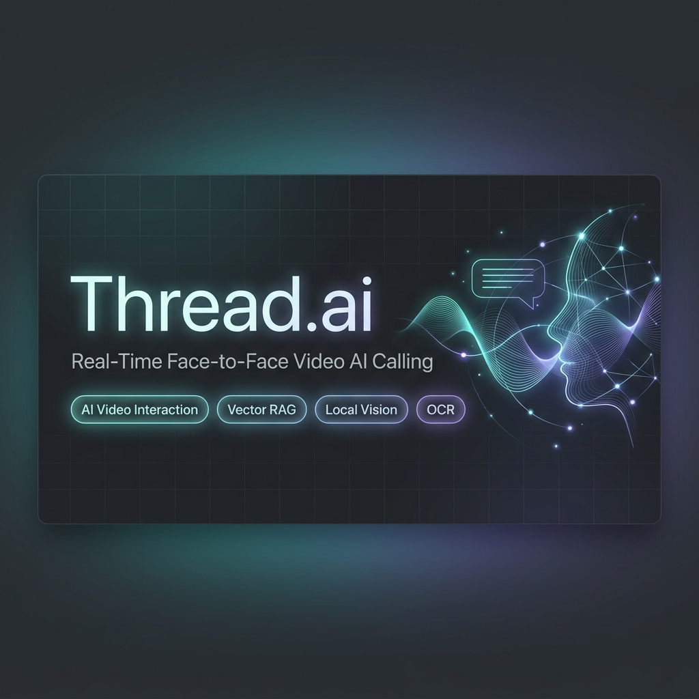
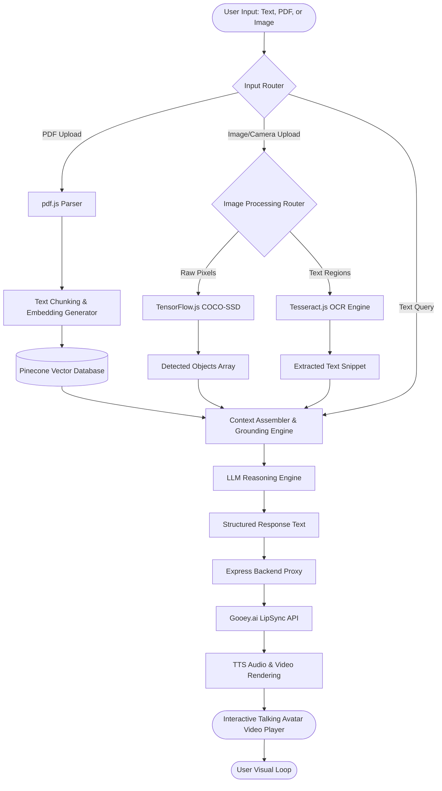
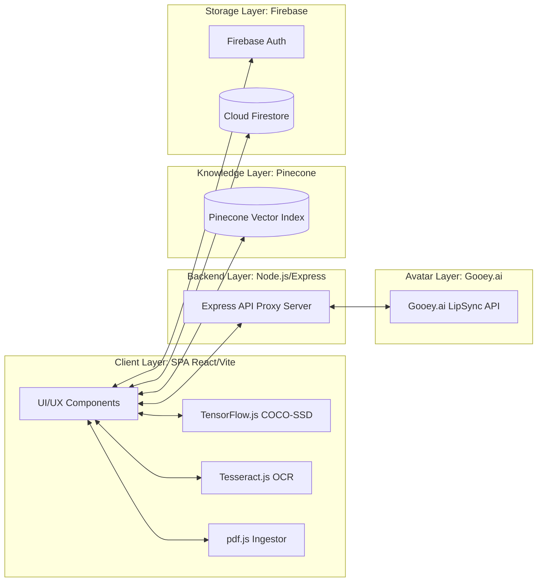

# Thread.ai
### Real-Time Multimodal Face-to-Face AI Video Calling & Interaction Platform

An interactive AI platform enabling real-time, face-to-face video calls with an AI agent. The platform combines visual understanding, document comprehension, and semantic knowledge retrieval with an AI video interaction agent that speaks and responds in sync, simulating a natural face-to-face conversation.

[](#)
[](#)
[](#)
[](#)
[](#)
[](#)
[](#)
[](#)

---

| Resource | Link |
| :--- | :--- |
| **Live Product Portal** | [threadai-bharat-aws-genai.vercel.app](https://threadai-bharat-aws-genai.vercel.app/) |
| **Demonstration Video** | [youtu.be/ci9qdkgSVss](https://youtu.be/ci9qdkgSVss) |
| **System Slide Deck** | [Google Drive Slides Link](https://drive.google.com/file/d/1j74qSU0fiax_Je0gJxyRurgjA-CeSZgP/view?usp=sharing) |
| **Technical Documentation** | [Google Docs Project Report](https://docs.google.com/document/d/1Uqi4W7bhbHs56ksUohuj69Ux1aw64ah1xIvUzm2ykf0/edit?usp=sharing) |
| **GitHub Source Code** | [github.com/viv2005ek/ThreadAi-RealTimeAiVideoCall](https://github.com/viv2005ek/ThreadAi-RealTimeAiVideoCall) |

**Project Recognition:** First Position – AI Track (National Project Expo), Top-9 Global Finalist at NextGenHacks, and Finalist at the AMD Slingshot AI Innovation Challenge. Recognized for innovations in multimodal model orchestration, client-side browser performance engineering, and conversational face-to-face video calling pipeline design.

---



---

## Overview

Thread.ai is a unified, real-time multimodal AI calling platform designed to coordinate diverse intelligence subsystems into a single, high-fidelity user experience. The core design thesis of the platform centers on the **Real-Time Video AI Call**—shifting away from static text-based prompts to create an active, face-to-face video conferencing window with a digital human avatar.

In this layout, the AI agent is visually present directly in front of the user's eyes, simulating a live video call. The agent listens to spoken inputs, analyzes uploaded documents, processes visual assets (such as screenshots or real-time camera feeds), and responds dynamically with synthesized speech matched to realistic facial expressions and video responses.

To make this execution pipeline possible, the system acts as a central coordinator. It integrates client-side edge models (local computer vision via TensorFlow.js and Optical Character Recognition via Tesseract.js) with remote cloud engines (Pinecone for vector retrieval, Cloud Firestore for history persistence, and Gooey.ai for real-time video call response rendering). Offloading initial analysis directly to the browser minimizes backend latency and reduces server computing requirements.

By synchronizing these separate inputs and models into a single conversational session, Thread.ai shows how multimodal models can work together in a low-latency environment. It establishes a pattern for face-to-face human-computer interaction, bridging the gap between isolated single-purpose AI tools and a unified communication interface.

---

## Why Thread.ai?

### The Problem: Fragmented Workflows and Lack of Presence
Traditional AI workflows are highly fragmented, requiring users to copy and paste data between disjointed single-purpose tools:
1. **Chatbots** for basic text responses.
2. **OCR Software** to extract text from images.
3. **PDF Parsers** to read documents.
4. **Vector Retrieval Systems** to recall enterprise knowledge.
5. **Computer Vision Engines** to analyze webcam feeds.
6. **Avatar Generators** to produce speech animations.

This disconnected workflow causes significant issues:
* **Context Loss:** Switching apps clears conversation state and history.
* **UX Friction:** Copy-pasting data across systems slows down interactions.
* **Lack of Human Connection:** Text-only outputs feel impersonal, reducing engagement in learning, customer service, and advising.

### The Solution: A Unified Face-to-Face AI Call
Thread.ai unifies these systems into a single interface. Instead of using separate tools, the user joins a live video call with an AI agent. The agent can "see" the user's camera feed, "read" their uploaded documents, "remember" previous conversations, and explain complex concepts face-to-face.

```
                  FRAGMENTED WORKFLOW (TRADITIONAL)
[Image] ──> (OCR App) ──> [Text Copy] ──> (ChatGPT) ──> [Response Text] ──> (TTS App) ──> [Audio File]
                                                                                            
                  UNIFIED WORKFLOW (THREAD.AI)
[Image/PDF/Text] ───────> (Thread.ai Orchestrated Pipeline) ───────> [Talking AI Avatar Video]
```

### Capability Comparison Matrix

| System Capability | Traditional Chatbot | Thread.ai Face-to-Face Platform |
| :--- | :---: | :---: |
| **Conversational Text Interface** | ✓ Yes | ✓ Yes |
| **AI Video Interaction Agent** | ✗ No | ✓ Yes (Real-time video call stream) |
| **Edge Computer Vision (Object Detection)** | ✗ No | ✓ Yes (Local COCO-SSD) |
| **Optical Character Recognition (OCR)** | ✗ No | ✓ Yes (Local Tesseract.js) |
| **Client-Side PDF Text Ingestion** | ✗ No | ✓ Yes (Local pdf.js parsing) |
| **Semantic RAG Knowledge Retrieval** | ✗ No / Premium | ✓ Yes (Pinecone DB integration) |
| **Persistent Multi-Session Database** | Varies | ✓ Yes (Firebase + Firestore) |
| **Hybrid Edge/Cloud Architecture** | ✗ No | ✓ Yes (Throttled local inference) |
| **Unified Conversational State** | ✗ No | ✓ Yes |

---

## What We Built

Thread.ai includes the following core technical capabilities:

* **Real-Time Video AI Calling Interface:** A face-to-face calling layout built with React Router v7. It simulates an active video call stream, managing audio playback states and synchronization between transcripts and video frames.
* **Retrieval-Augmented Generation (RAG):** Connects to a Pinecone vector index to query text embeddings, providing the AI agent with specific, domain-grounded knowledge to prevent hallucinations.
* **Client-Side PDF Ingestion:** Uses `pdfjs-dist` to parse PDFs in the browser, extracting text segments for vector embedding generation without sending raw files to external servers.
* **Optical Character Recognition (OCR) Engine:** Integrates `Tesseract.js` in a browser worker thread to extract text from images, diagrams, or screenshots locally.
* **Local Computer Vision (COCO-SSD):** Runs TensorFlow.js with the COCO-SSD model to identify objects in real-time camera captures, adding visual context directly into the AI's prompts.
* **AI Video Synthesis Pipeline:** Coordinates an Express backend server and the Gooey.ai API to generate synchronized TTS audio and real-time video responses from text responses.
* **Firebase Authentication:** Handles secure user signup, sign-in, and session tokens, keeping user sessions isolated.
* **Persistent Session Storage:** Uses Cloud Firestore to save, retrieve, and delete historical conversation sessions, ensuring state persists across page reloads.
* **Agent Persona Engine:** Supports switching between customized avatar personalities (such as corporate support agents or virtual tutors), adjusting system instructions and voice settings.

---

## End-to-End AI Pipeline

The following diagram traces how inputs (text, documents, or images) are processed by local and cloud models to generate a synchronized video response:



### Pipeline Stage Details

1. **Ingestion & Routing:** Receives text prompts, uploaded PDFs, or image assets, routing them to the appropriate browser-side extractor.
2. **Client-Side Document Parsing:** `pdfjs-dist` reads PDFs locally in the browser, extracting raw text and formatting it into paragraphs.
3. **Local Computer Vision & OCR:**
   * **COCO-SSD** runs local object detection on image pixels, outputting identified labels and confidence scores.
   * **Tesseract.js** runs local OCR in a web worker, extracting text blocks from screenshots or scanned uploads.
4. **Vector Retrieval:** The extracted text chunks are converted to vector embeddings and queried against Pinecone to retrieve relevant background information.
5. **Context Assembly:** Aggregates user text, session history, detected objects, OCR text, and vector database matches into a structured system prompt.
6. **Response Generation:** The LLM processes the prompt and generates a structured text response.
7. **AI Video Call Response Synthesis:** The backend proxy receives the text response and calls Gooey.ai to synthesize speech audio and render an interactive talking video matching the agent's profile.
8. **Visual Playback:** The resulting video streams to the custom `VideoPlayer` component, updating the chat transcript when playback completes.

---

## System Architecture

The application is split into a frontend SPA, a backend proxy, and cloud services to secure keys and optimize resource usage:



### Architecture Layer Responsibilities

* **Frontend (React 18 + Vite + TypeScript):** Manages UI components, page routes (React Router v7), state machines, local vision/OCR model execution, local PDF parsing, and video player state synchronization.
* **AI Processing Layer:** Coordinates local models (TensorFlow and Tesseract) in the browser to reduce server workloads and protect user privacy.
* **Knowledge Layer:** Queries the Pinecone vector index to retrieve relevant text segments for grounding responses.
* **Backend Proxy (Node.js + Express):** Acts as an API gateway, securing the Gooey.ai API key and proxying video generation requests.
* **Storage & Auth Layer (Firebase):** Manages user sign-up/login sessions and stores conversation histories in Cloud Firestore.
* **Avatar Generation Pipeline:** Synthesizes voice audio from text and renders a conversational video response using target avatar images.

---

## Engineering Decisions & Trade-Offs

### 1. Pinecone for Vector Storage
* **Decision:** Selected Pinecone for vector indexing and retrieval.
* **Rationale:** Pinecone is a fully managed, serverless vector database that offers sub-100ms index lookup speeds and scales without complex configuration.
* **Trade-Off:** Using a cloud database requires network requests, adding latency. The alternative, client-side vector search (e.g., Voy or Orama), would keep search local but would increase browser memory consumption when loading large indexes.

### 2. Firebase for Auth & History Persistence
* **Decision:** Implemented Firebase Authentication and Cloud Firestore.
* **Rationale:** Firebase provides secure authentication out-of-the-box and handles real-time data synchronization with minimal code. Firestore’s document model makes it easy to store conversation histories.
* **Trade-Off:** Firebase is a proprietary platform, which makes it harder to migrate to other systems. However, this trade-off was acceptable to speed up development and focus on the AI orchestration pipeline.

### 3. Gooey.ai for the Avatar Pipeline
* **Decision:** Integrated Gooey.ai for synchronized speech and video call rendering.
* **Rationale:** Gooey.ai combines text-to-speech generation and conversational video rendering into its API. This simplifies development compared to maintaining separate models like Wav2Lip.
* **Trade-Off:** Cloud-rendered video synthesis is resource-heavy, introducing a 3 to 5-second latency before video playback starts. This is managed in the UI with loading skeletons and real-time text transcript previews.

### 4. Client-Side Tesseract.js & TensorFlow.js (COCO-SSD)
* **Decision:** Ran OCR and object detection locally in the browser.
* **Rationale:** Running models in the browser reduces backend hosting costs and ensures user files remain private, as images do not need to be uploaded to a server for analysis.
* **Trade-Off:** Local execution depends on the user's hardware. Low-end mobile devices can experience CPU spikes. To mitigate this, model loading is deferred and processing is throttled.

### 5. Node.js & Express for the Backend Proxy
* **Decision:** Implemented a backend proxy server to interact with Gooey.ai.
* **Rationale:** Hiding third-party API keys behind a backend server prevents exposing credentials in the client-side code.
* **Trade-Off:** This introduces a middleman server in the video request pipeline. However, it is necessary to secure API endpoints in a production-ready application.

### 6. Client-Side PDF Parsing via pdfjs-dist
* **Decision:** Used `pdfjs-dist` to parse PDFs in the browser.
* **Rationale:** Parsing files locally prevents server bottlenecks when multiple users upload documents at the same time.
* **Trade-Off:** The browser must download the `pdf.worker.js` library, which increases the initial bundle size. This is resolved by loading the worker asynchronously.

---

## Technical Challenges & Solutions

### 1. Latency Compounding in the Multimodal Pipeline
* **Challenge:** Chaining text generation, text-to-speech, and AI video generation into a sequential pipeline created a long delay before the user received a response.
* **Solution:** Implemented **async pre-generation** and **split-rendering**. When the LLM outputs text, the UI displays it immediately in a chat bubble, while the backend processes the TTS and video sync in the background. The avatar video plays once ready, ensuring the system feels responsive.

### 2. Video Queue and Stream Preloading in React
* **Challenge:** When responses are broken into multiple audio-video blocks, loading video URLs dynamically inside the HTML5 `<video>` tag causes flickering, delay, and audio clipping between transitions.
* **Solution:** Designed a sequential preload queue inside `VideoPlayer.tsx`. The component spins up hidden, muted background video elements to preload subsequent video chunks asynchronously while the current chunk plays. Direct DOM references bypass the React rendering engine to handle transition hooks instantly, resulting in a continuous, flicker-free video stream. If a network drop occurs, a fallback mouth-movement animation is generated dynamically using CSS transitions over the static avatar image, maintaining visual activity.

### 3. Main-Thread Blocking during Local Inference
* **Challenge:** Running object detection (COCO-SSD) and OCR (Tesseract.js) in the browser caused the user interface to stutter and drop frames.
* **Solution:** Offloaded Tesseract processing to a dedicated web worker and throttled TensorFlow frame analysis, running inference only on keyframes instead of the full video capture stream.

### 4. High-Density Context Grounding
* **Challenge:** Combining document context, vision data, and OCR text often exceeded token limits, causing the LLM to lose focus or hallucinate.
* **Solution:** Built a context assembler that cleans data inputs, summarizes OCR text, and sorts retrieved document fragments using cosine similarity scores to keep prompts concise.

### 5. Multi-Session Hydration & Local Cache Latency
* **Challenge:** Fetching chat history from Firestore on every session switch caused noticeable loading delays.
* **Solution:** Implemented a hybrid caching strategy using Firestore offline persistence and a local state context. This allows switching between chats instantly while data syncs in the background.

---

## Tech Stack

### Frontend Core & UI
* **React 18** - Dynamic single-page application structure.
* **TypeScript** - Strongly typed code architecture.
* **Vite** - High-speed bundler and development server.
* **TailwindCSS** - Responsive design styling.
* **Framer Motion** - Interface animations and transitions.

### Client-Side AI & Machine Learning
* **TensorFlow.js & COCO-SSD** - Real-time client-side object detection.
* **Tesseract.js** - Client-side OCR engine.
* **pdfjs-dist** - Client-side PDF ingestion and text extraction.

### Backend Infrastructure
* **Node.js** - Runtime environment for the API server.
* **Express** - Minimalist API router and request proxy.
* **Gooey.ai LipSync API** - Cloud-based real-time video rendering and TTS alignment.

### Database, Storage & Auth
* **Pinecone DB** - Managed vector database for semantic retrieval.
* **Firebase Authentication** - Secure user registration and session management.
* **Cloud Firestore** - Document database for persistent chat histories.

---

## Repository Structure

The project is organized into modular directories to separate the client app, backend proxy, and state managers:

```
ThreadAi-RealTimeAiVideoCall/
├── .env.example                # Template for frontend environment variables
├── eslint.config.js            # Linter configuration for code quality
├── index.html                  # Entry HTML page
├── package.json                # Project dependencies and script runner configurations
├── postcss.config.js           # PostCSS compiler configuration
├── tailwind.config.js          # Tailwind CSS style overrides and theme configuration
├── tsconfig.json               # Global TypeScript compiler configurations
├── tsconfig.app.json           # Frontend application TypeScript settings
├── tsconfig.node.json          # Node environment TypeScript settings
├── vite.config.ts              # Vite asset bundling and compiler pipeline setup
├── threadai_hero_banner.png    # Repository banner image
│
├── gooey/                      # BACKEND PROXY WORKSPACE
│   ├── package.json            # Node.js backend server dependency configuration
│   └── server.js               # Express API server for Gooey.ai communication
│
├── src/                        # FRONTEND CODEBASE
│   ├── App.tsx                 # Core application router and view dispatcher
│   ├── main.tsx                # Client app entry mount point
│   ├── index.css               # Global stylesheets and utility variables
│   ├── vite-env.d.ts           # Type definitions for environment variables
│   │
│   ├── components/             # REUSABLE UI ELEMENTS
│   │   ├── AnimatedBackground.tsx  # Dynamic particle system background
│   │   ├── AvatarSettingsPanel.tsx # Interface for managing avatar voice and parameters
│   │   ├── ChatHeader.tsx          # Top bar displaying session actions and status
│   │   ├── ChatView.tsx            # Main chat layout orchestrating all sub-systems
│   │   ├── CompanyChat.tsx         # Enterprise agent support variant
│   │   ├── MessageBubble.tsx       # Text bubble with markdown and user metadata
│   │   ├── MessageInput.tsx        # Input area with file attachments and voice capture
│   │   ├── ProtectedRoute.tsx      # Route guard verifying Firebase auth tokens
│   │   ├── Sidebar.tsx             # Panel managing chat histories and session creation
│   │   ├── TranscriptView.tsx      # Real-time text display synced with video playback
│   │   ├── VideoPlayer.tsx         # Custom player handling avatar video stream states
│   │   └── VirtualEyesChat.tsx     # Computer vision interactive interface component
│   │
│   ├── contexts/               # REACT CONTEXTS (GLOBAL STATE)
│   │   └── AuthContext.tsx     # Distributes authentication state across components
│   │
│   ├── lib/                    # UTILITY INITIALIZATIONS
│   │   └── firebase.ts         # Establishes connection client to Firebase instance
│   │
│   ├── pages/                  # APPLICATION ROUTED PAGES
│   │   ├── Dashboard.tsx       # Core workspace page containing active chat interfaces
│   │   ├── Landing.tsx         # Welcome page introducing features
│   │   ├── Login.tsx           # Email login interface
│   │   └── Signup.tsx          # User registration portal
│   │
│   ├── services/               # DATA SERVICES & API WRAPPERS
│   │   ├── companyMembers.ts   # Definition profiles for custom avatar assistants
│   │   ├── firestore.ts        # Database utilities (saving, retrieving, deleting history)
│   │   ├── gooey.ts            # Client interface for the Gooey API
│   │   ├── lipsync.ts          # State definitions for video interaction models
│   │   ├── mockAI.ts           # Local backup fallback reasoning models
│   │   ├── pdfParser.ts        # Wrapper for extraction using pdfjs-dist
│   │   ├── pinecone.ts         # Query engine for Pinecone vector searches
│   │   ├── tts.ts              # Text-To-Speech synthesis interface
│   │   └── vision.ts           # Orchestrator for TensorFlow (COCO-SSD) and OCR (Tesseract)
│   │
│   └── types/                  # TYPESCRIPT INTERFACES
│       └── index.ts            # Typings for sessions, avatars, and data payloads
```

---

## Installation

To run Thread.ai locally, follow the steps below to set up both the frontend and backend environments:

### 1. Clone the Repository
```bash
git clone https://github.com/viv2005ek/ThreadAi-RealTimeAiVideoCall.git
cd ThreadAi-RealTimeAiVideoCall
```

### 2. Install Frontend Dependencies
Run this in the root directory to install React, Tailwind, and local ML packages:
```bash
npm install
```

### 3. Install Backend Server Dependencies
Navigate to the `/gooey` subdirectory and install the required Node packages:
```bash
cd gooey
npm install
cd ..
```

---

## Running the Project

To run the application, you need to launch both the frontend development server and the backend proxy server at the same time:

### Step 1: Start the Frontend Client
From the project root directory, run:
```bash
npm run dev
```
The client app will launch locally at:
```
http://localhost:5173
```

### Step 2: Start the Backend Proxy Server
In a new terminal window, navigate to the `/gooey` directory and run:
```bash
cd gooey
node server.js
```
The proxy server will launch at:
```
http://localhost:3001
```

---

## Environment Variables

You need to set up environment variables for both the client and server applications.

### 1. Frontend Configuration
Create a `.env` file in the project root directory:
```env
# Firebase Configuration
VITE_FIREBASE_API_KEY=your_firebase_api_key
VITE_FIREBASE_AUTH_DOMAIN=your_project.firebaseapp.com
VITE_FIREBASE_PROJECT_ID=your_project_id
VITE_FIREBASE_STORAGE_BUCKET=your_project.appspot.com
VITE_FIREBASE_MESSAGING_SENDER_ID=your_messaging_sender_id
VITE_FIREBASE_APP_ID=your_firebase_app_id

# Pinecone Configuration
VITE_PINECONE_API_KEY=your_pinecone_api_key
VITE_PINECONE_INDEX_NAME=your_pinecone_index_name
```

### 2. Backend Proxy Configuration
Create a `.env` file inside the `/gooey` subdirectory:
```env
# Gooey.ai API Credentials
GOOEY_API_KEY=your_gooey_api_key
PORT=3001
```

---

## Features Explained

### Retrieval-Augmented Generation (RAG) & Document Intelligence
The RAG pipeline allows the AI to answer questions based on the contents of uploaded PDF documents:
1. **Document Upload:** The user uploads a PDF document via the chat interface.
2. **Client-Side Ingestion:** `pdfjs-dist` extracts raw text from the document inside the browser.
3. **Text Chunking:** The extracted text is split into smaller, overlapping chunks (e.g., 500 characters with a 100-character overlap) to preserve context.
4. **Embedding Generation:** Each text chunk is converted into a vector representation (embedding).
5. **Vector Search Indexing:** These embeddings are stored in a Pinecone vector index.
6. **Context Injection:** When the user asks a question, the system searches the Pinecone index for the most relevant text chunks and injects them into the LLM's prompt context, ensuring accurate, grounded answers.

```
[PDF Upload] ──> (pdf.js) ──> [Text Chunks] ──> (Embeddings) ──> [Pinecone Database]
                                                                        │
[User Query] ───────────────────> (Search Query) ───────────────────────┘
                                        │
                                        ▼
[Grounded Prompt] ──> (LLM Generation) ──> [Accurate Answer]
```

### Computer Vision & OCR Layer
The vision system allows the AI to see and read images uploaded by the user:
* **Object Detection (COCO-SSD):** When an image is uploaded or captured via webcam, TensorFlow.js scans the image locally and identifies objects, adding them to the prompt context (e.g., "The image contains a laptop and a mug").
* **Optical Character Recognition (Tesseract.js):** Tesseract scans the image for written text, extracts it, and appends it to the prompt context. This enables the AI to answer questions about text in screenshots, receipts, or diagrams.

### AI Video Call Response Pipeline
The avatar pipeline turns text responses into talking video animations:
1. **Text Synthesis:** The LLM generates a text response.
2. **Backend Proxy Request:** The frontend sends the text to the backend proxy.
3. **AI Video Interaction API:** The backend calls the Gooey.ai LipSync API, which synthesizes speech audio and animates the avatar's face using real-time video calling models.
4. **Video Stream:** The API returns a video file URL, which the frontend plays inside the custom video component.

```
[Text Response] ──> (Express Proxy) ──> (Gooey.ai TTS) ──> (Gooey.ai LipSync API) ──> [Rendered Video URL]
                                                                                            │
[Video Playback] <───────────────── (Custom Video Player) <─────────────────────────────────┘
```

---

## Real-World Use Cases

* **Enterprise Knowledge Assistant:** Ingests internal company wikis, policies, and manuals into a Pinecone index. Employees can query this documentation and receive clear, face-to-face video responses.
* **Customer Support (with CRM Integration):** Acts as a customer service representative, using RAG to answer product questions and responding via a friendly digital avatar.
* **Sales Assistant:** Provides live, face-to-face consultations, retrieving catalog details and answering product specifications in real-time.
* **AI Tutor:** Students can upload textbooks, homework sheets, or diagrams. The tutor can analyze diagrams via computer vision and explain complex topics face-to-face.
* **Research Assistant:** Allows researchers to query large collections of academic papers, receiving synthesized visual and auditory summaries of findings.
* **Healthcare Assistant:** Simulates patient intake procedures, providing interactive advisory responses based on medical manuals and user questions.
* **Internal Company Copilot:** Helps developers and administrators query technical specifications, system logs, or architecture diagrams.
* **Document Intelligence Analyst:** Analyzes invoices, contracts, or financial tables, extracting data via client-side OCR and summarizing the information.
* **Interactive AI Persona:** Creates digital avatars representing historical figures or customer profiles for training and educational purposes.
* **Accessibility Assistant:** Helps visually impaired users by reading text from images (OCR) or explaining what is in their camera view (object detection) through spoken voice.

---

## Production Scalability Plan

To scale Thread.ai for production workloads, the architecture can be updated with the following cloud-native components:

```
                            SCALABLE ARCHITECTURE
[Edge Clients] ──> (Cloudflare Load Balancer) ──> [Docker Containers on AWS ECS]
                                                          │
                    ┌─────────────────────────────────────┴─────────────────────────────┐
                    ▼                                                                   ▼
       (Redis Cache / Sess State)                                            (WebSockets API Gateway)
                    │                                                                   │
                    ▼                                                                   ▼
       [Pinecone Vector Database]                                            [Gooey.ai Video Queues]
```

* **Streaming Inference & WebSockets:** Replace HTTP requests with WebSocket connections to stream LLM tokens and audio packets. This allows the avatar to start speaking as the text is generated, reducing startup latency.
* **Redis Caching Layer:** Implement a Redis cache on the backend to store frequently requested avatar videos, saving API costs and rendering time.
* **Containerization with Docker:** Package the backend proxy and client application into Docker containers to simplify deployment across various cloud services.
* **Horizontal Scaling & Load Balancing:** Deploy the backend containers to container services like AWS ECS or Kubernetes, using a load balancer to distribute traffic.
* **Edge Ingestion Networks:** Deploy the frontend code to edge networks like Vercel or Cloudflare Workers to improve page load times worldwide.
* **Observability & Monitoring:** Integrate monitoring tools like Prometheus and Grafana to track API errors, latency, and system performance.

---

## Future Roadmap

### Short-Term Goals (Next 1-2 Quarters)
* **Streaming LLM Responses:** Integrate token streaming to display text answers instantly as they are generated.
* **Video Latency Optimization:** Cache common video segments and pre-warm TTS channels to reduce start delays.
* **Production Deployment:** Transition the backend service to run inside Docker containers.

### Long-Term Goals (Next 3-4 Quarters)
* **CRM Integration for Personalized Support Calls:** Connect the face-to-face video calling system with Customer Relationship Management (CRM) databases (e.g., Salesforce, HubSpot). This allows the AI agent to recall user history, account details, and past preferences during the call, creating a personalized experience.
* **Face-to-Face Virtual Classrooms:** Implement live video tutoring sessions where the AI tutor can track student engagement, analyze student handwriting/diagrams through the camera feed, and explain concepts interactively.
* **Long-Term Memory:** Implement hierarchical database storage to remember user preferences across different sessions.
* **Multi-Agent Collaboration:** Create a team of specialized AI agents that can pass tasks to one another.
* **Real-Time Voice Conversations:** Enable direct voice input and response, bypassing the chat keyboard entirely.
* **Enterprise Knowledge Graphs:** Supplement vector databases with knowledge graphs to better understand relationships between different datasets.
* **Fine-Grained Authorization:** Add Role-Based Access Control (RBAC) to restrict document access based on user roles.

---

## Lessons Learned

* **AI Systems are Orchestration Challenges:** Building modern AI applications is less about training models and more about coordinating them. Managing data flow across local browser models and cloud APIs is key to a smooth user experience.
* **Retrieval Quality Matters More than Model Size:** Having clean, relevant context from a vector database (RAG) often improves answer quality more than simply using a larger, more expensive language model.
* **Latency Compounds Across Pipelines:** When chaining multiple API calls together (LLM -> TTS -> Video Generation), latency quickly adds up. Designing asynchronous UI elements and loading states is crucial.
* **Prompt Engineering Alone is Insufficient:** Relying solely on prompt formatting is not enough for complex applications. A robust system requires clean input data, vector search grounding, and error-handling fallbacks.
* **UX is Determined by Infrastructure:** Fast database queries and efficient client-side code are what make an application feel responsive, highlighting the importance of system design.

---

## Contributing

Contributions are welcome! Please follow these steps to contribute to the project:

1. **Fork the Repository:** Create a personal copy of the repository on GitHub.
2. **Create a Feature Branch:** Build your changes in a new git branch:
   ```bash
   git checkout -b feature/your-feature-name
   ```
3. **Commit Your Changes:** Write clear, descriptive commit messages:
   ```bash
   git commit -m "feat: add CRM lookup hooks to avatar initializer"
   ```
4. **Push to GitHub:** Push your branch to your forked repository:
   ```bash
   git push origin feature/your-feature-name
   ```
5. **Open a Pull Request:** Describe your changes and explain how they affect the system architecture.

Please ensure your code passes TypeScript type checks and conforms to the project's ESLint rules before submitting a pull request.

---

## License

This repository is licensed for **Educational / Research Use Only**. Commercial distribution or deployment of this code requires written authorization from the author.

---

## Author

**Vivek Kumar Garg**  
*AI Systems Builder & Full-Stack Engineer*  
* **Portfolio:** [vivekfolio-six.vercel.app](https://vivekfolio-six.vercel.app/)
* **GitHub:** [@viv2005ek](https://github.com/viv2005ek)
* **LinkedIn:** [Vivek Kumar Garg Profile](https://www.linkedin.com/in/vivek-kumar-garg-097677280/)

---

> Thread.ai demonstrates how conversational AI, vector search databases, client-side computer vision, and video synthesis can be coordinated to create a unified face-to-face AI calling experience.
